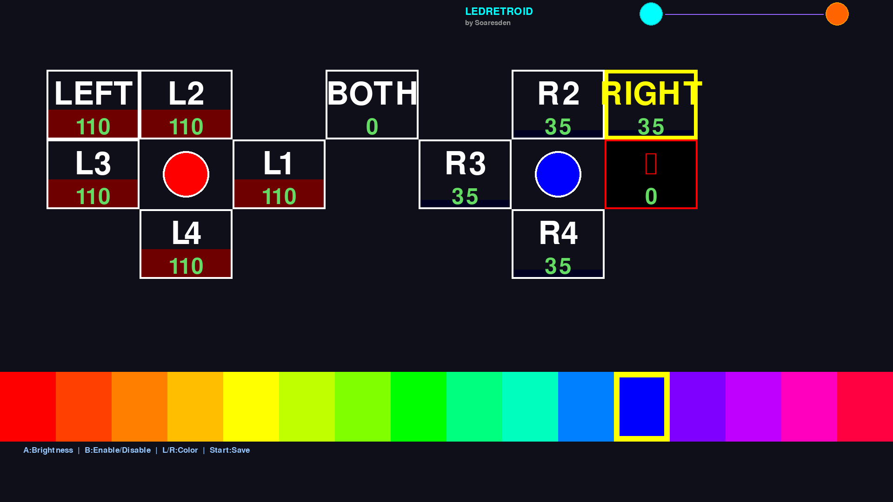

# 🎮 Retroid Pocket 5 LED Controller

## ✨ Overview
A pygame-based LED controller for Retroid Pocket 5 that lets you customize button LEDs with custom colors and brightness. The app automatically installs a Batocera service to persist your settings across reboots.

## 📸 Preview


## 🚀 Features
- 🎨 **16 vibrant colors** to choose from
- 💾 **Auto-save configuration** to JSON format
- 🔧 **Parent-child LED hierarchy** (control groups or individual buttons)
- ⚡ **Real-time LED updates** on hardware
- 🤖 **Automatic Batocera service** installation
- 📊 **Clean, readable JSON** configuration file
- 🎯 **Intuitive pygame interface** with visual feedback

## 📋 Installation

### 1. Copy Files
```bash
mkdir -p /userdata/roms/pygame/ledretroid/
cp led_retroid.pygame /userdata/roms/pygame/ledretroid/
```

### 2. Launch from Batocera
- Go to **Games → Pygame → led_retroid**
- First launch auto-installs the service ✅

## 🎮 Controls

| Button | Action |
|--------|--------|
| **D-Pad** | Navigate between LEDs |
| **A** | Increase brightness |
| **B** | Enable/Disable LED |
| **L/R** | Change color (cycle through 16 colors) |
| **START** | Save settings & Exit |

## 🎨 Color Palette
Red → RedOrange → Orange → OrangeYellow → Yellow → YellowGreen → Lime → Green → GreenCyan → CyanGreen → Cyan → Blue → BluePurple → Purple → Magenta → MagentaRed

## 📁 Configuration
Configuration is stored at: `/userdata/roms/pygame/ledretroid/colorsave.json`

### Example JSON Structure
```json
{
  "Left Joystick": {
    "L1_Right": {"enabled": true, "color": "#FF0000", "brightness": 255},
    "L2_Up": {"enabled": true, "color": "#FF7F00", "brightness": 100},
    "L3_Left": {"enabled": false, "color": "#0000FF", "brightness": 0},
    "L4_Down": {"enabled": true, "color": "#FF7F00", "brightness": 50}
  },
  "Right Joystick": {
    "R1_Right": {"enabled": false, "color": "#7F00FF", "brightness": 0},
    "R2_Up": {"enabled": true, "color": "#FFFF00", "brightness": 255},
    "R3_Left": {"enabled": true, "color": "#7F00FF", "brightness": 100},
    "R4_Down": {"enabled": false, "color": "#FFFF00", "brightness": 0}
  },
  "Controls": {
    "LEFT": {"color": "#FF0000", "brightness": 100},
    "RIGHT": {"color": "#00FF00", "brightness": 100},
    "BOTH": {"color": "#0000FF", "brightness": 0}
  }
}
```

## 🔧 How It Works
1. **Reads/writes LED config** from JSON file
2. **Controls LEDs via sysfs** (`/sys/class/leds/`)
3. **Service disables Batocera LED daemon** to avoid conflicts
4. **Parent controls** (LEFT/RIGHT/BOTH) override child LEDs
5. **Auto-applies on boot** via Batocera service

## 📊 LED Hierarchy
```
BOTH (Master - affects all 8 LEDs)
├── LEFT (L1, L2, L3, L4)
└── RIGHT (R1, R2, R3, R4)
```

- **BOTH enabled** → overrides all individual LEDs
- **LEFT/RIGHT enabled** → overrides their child LEDs
- **Individual LEDs** → lowest priority

## ⚙️ Technical Details
- **Language**: Python 3 + Pygame
- **Dependencies**: pygame (included in Batocera)
- **No external packages** required
- **Service auto-disables** `batocera-led-handheld` daemon
- **Service auto-starts** on boot
- **Logging**: `/tmp/led_controller.log`

## 🛠️ Troubleshooting

### LEDs not changing?
- Check if service is enabled: `batocera-services status retroid5_led`
- Check logs: `cat /tmp/led_controller.log`
- Restart service: `batocera-services restart retroid5_led`

### Colors look wrong?
- LED values are 0-255 for each RGB channel
- Brightness adjusts the intensity multiplier
- Disabled LEDs show as red X in the interface

### Settings not persisting?
- Verify JSON is being saved: `cat /userdata/roms/pygame/ledretroid/colorsave.json`
- Check file permissions: `ls -la /userdata/roms/pygame/ledretroid/`
- Restart after changes: EXIT app fully before rebooting

## 📝 Files
```
/userdata/roms/pygame/ledretroid/
├── led_retroid.pygame          # Main application
├── colorsave.json              # Configuration (auto-created)
└── logs/led_controller.log      # Debug logs
```

## 🎯 Future Improvements
- [ ] Preset color schemes
- [ ] Animation support
- [ ] Brightness profiles
- [ ] Per-game LED settings
- [ ] Web interface control

## 👨‍💻 Credits
Made with ❤️ by **Soaresden** for Retroid Pocket 5 enthusiasts

Built with Python + Pygame + AI assistance

---

**Enjoy customizing your LEDs! 🌈**